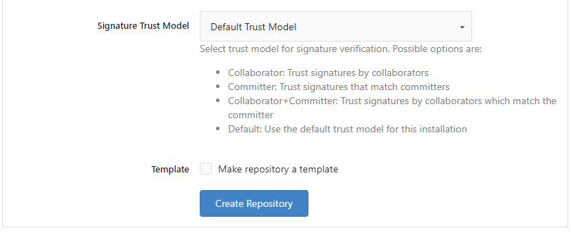

# Gestion de projet : Gestion de versions Git 
## Création du projet en ligne
Donc évidemment le projet a été créé sur https://git.s11.fr/ par l'un des membres du groupe. Dans notre cas il s'agissait de Benjamin BARIAL.
Pour la création, il suffit de ce rendre, une fois connecté, en haut à droite du site sur l'icone "Create" :


Après cela, une page avec un formulaire apparait :




Explications :
- Owner : le propriétaire du répertoire
- Repository Name : le nom du répertoire
- Visibility : si on le rend visible aux yeux de tous, ou seulement au propriétaire et aux collaborateurs
- Description : une description du projet
- Template : si l'on veut reprendre un autre sujet comme base de celui-ci
- Issue Labels : 
- .gitignore : si l'on veut reprendre un autre .gitignore comme base de celui-ci
- License : si notre répertoire est partageable mais sous une license
- README : si l'on veut reprendre un autre README comme base de celui-ci
- Default Branch : le nom de la branche par défaut 
- Signature Trust Model : permet de définir qui pourra signer les demandes de merge request par exemple
- Template : si le projet doit devenir une template

Une fois ces champs remplis ou non, on crée le projet. 

## Partage du projet
Pour le partage du répertoire, il faut se rendre dans l'onglet "Settings", puis dans le sous onglet "Collaborators". Enfin on recherche les noms de nos camarades :


## Protection de la branche main
### Où trouver les configurations
Toujours dans l'onglet "Settings" mais cette fois ci dans le sous onglet "Branches", on appuis sur "Add New Rule":

    
On arrive ainsi sur une autre page de formulaire qui nous demande quelle sera la branche affectée par les règles :


### Configuration Push
Uniquement le Scrum Master est autorisé à push sur la branche main donc on configure de telle sorte :


Ainsi, uniquement la personne dans la liste blanche (c'est à dire le Scrum Master de la semaine) sera autorisée à push sur le main.

### Configuration Pull Request Approvals
Cela obligera au Scrum Master de la semaine de regarder si le code envoyé est suffisamment bon pour être intégré dans le projet :


### Configuration Pull Request Merge
Cela permettra au Scrum Master et uniquement à lui de faire des merges sur la branche main :


## Installation de Git en local
### Télécharger Git
Etant donné que tous les membres du groupe avaient déjà Git d'installer sur le PC cette étape ne sera pas présentée ici. Cependant voici comment installer rapidement Git sur Windows et Linux :
- Linux :
	```sh
	apt install git
	```
- Windows :
	Lancer cette exécutable : [Git](https://github.com/git-for-windows/git/releases/download/v2.42.0.windows.2/Git-2.42.0.2-64-bit.exe)
	ou via Winget :
	```powershell
	winget install --id Git.Git -e --source winget
	```
### Cloner répertoire distant
Pour cloner le répertoire distant sur sa machine locale, voici la succession de commandes à effectuer :
```sh
git remote add origin https://git.s11.fr/22willig/test.git
git push -u origin main
```